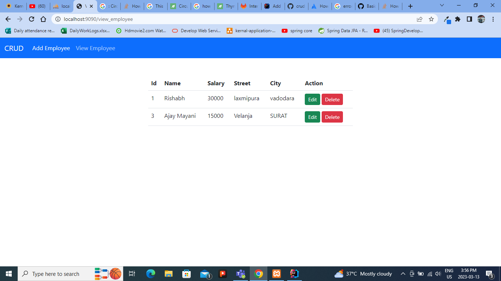

# crud-operation
this project create for practice purpose

1. Spring MVC
2. JPA
3. Thymeleaf
4. Bootstrap

<h6>Add employee form</h6>
<picture>

</picture>

<h6>View All Employee</h6>
<picture>

</picture>

<h6>Delete Employee</h6>
<picture>

</picture>

<h6>Update employee</h6
<picture>

</picture>

<h6>Add new Employee</h6>
<picture>

</picture>
