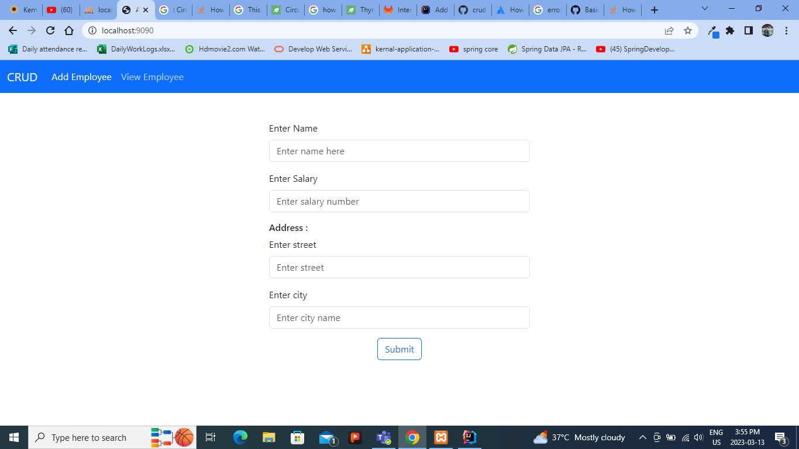
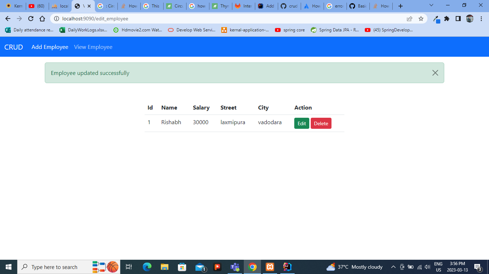

# crud-operation
this project create for practice purpose

1. Spring MVC
2. JPA
3. Thymeleaf
4. Bootstrap

<picture>
<h6>Add employee form</h6>

View All Employee

Delete Employee

Update employee

Add new Employee

</picture>
