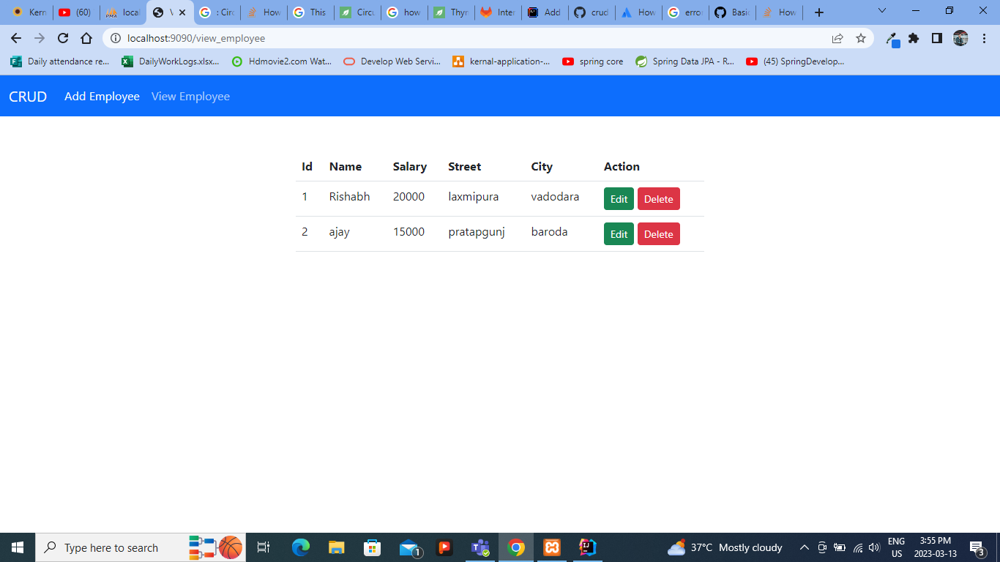

# crud-operation
this project create for practice purpose

1. Spring MVC
2. JPA
3. Thymeleaf
4. Bootstrap

<h3>Add employee form</h3>
<picture>

</picture>

<h3>View All Employee</h3>
<picture>

</picture>

<h3>Delete Employee</h3>
<picture>

</picture>

<h3>Update employee</h3>
<picture>

</picture>

<h3>Add new Employee</h3>
<picture>

</picture>
